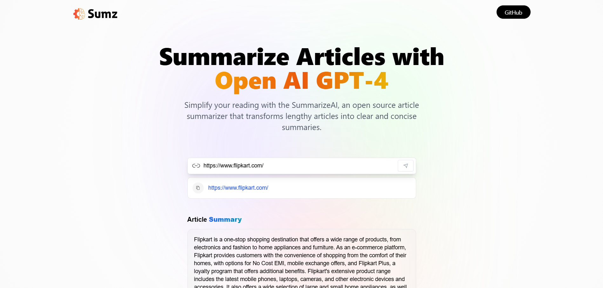

# AI Summarizer

## 📝 Project Overview
AI Summarizer is a web application that takes a URL of an article or website as input and generates a concise summary using AI. This project is built with **Next.js, Redux Toolkit, TypeScript, React.js, and Tailwind CSS**, and utilizes **RapidAPI** for the summarization feature.

## 🚀 Features
- 📄 Summarizes articles and web pages from a given URL.
- ⚡ Fast and efficient AI-generated summaries.
- 🎨 Modern and responsive UI built with Tailwind CSS.
- 🛠️ State management using Redux Toolkit.
- 🌐 API integration with RapidAPI for summarization.
- 🔍 User-friendly and intuitive interface.

## 🏗️ Tech Stack
- **Frontend:** Next.js, React.js, TypeScript, Tailwind CSS
- **State Management:** Redux Toolkit
- **API:** RapidAPI (for AI summarization)

## 📦 Installation

### 1️⃣ Clone the Repository
```bash
git clone https://github.com/CodewithMK180105/AI-Article-Summarizer.git
cd AI-Article-Summarizer
```

### 2️⃣ Install Dependencies
```bash
npm install
```

### 3️⃣ Set Up Environment Variables
Create a `.env.local` file in the root directory and add your RapidAPI key:
```env
NEXT_PUBLIC_RAPIDAPI_KEY=your_api_key_here
```

### 4️⃣ Run the Development Server
```bash
npm run dev  # or yarn dev
```
Open [http://localhost:3000](http://localhost:3000) in your browser.

## 📸 Screenshots


## 🚀 Deployment
You can deploy this project on **Vercel** easily:
```bash
vercel
```
Make sure to set up environment variables in Vercel settings.


## 🙌 Acknowledgments
- **RapidAPI** for the AI summarization feature.
- **Next.js & React.js** for building an efficient frontend.
- **Tailwind CSS** for modern styling.

## 🤝 Connect with Me
💼 LinkedIn: [Manishkumar Gupta](https://www.linkedin.com/in/manishkumar-gupta-1139642b5)  
📧 Email: manishkumar180105@gmail.com  
🌐 Portfolio: [Visit my PortFolio](https://manishkumarprofile.netlify.app/)
